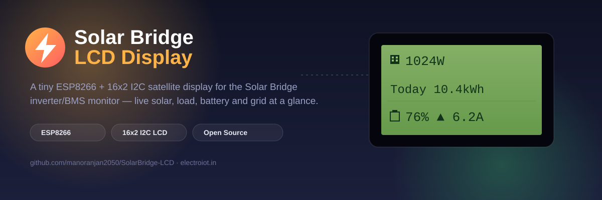

<p align="center">
  
</p>

A tiny satellite display for [Solar Bridge](https://github.com/manoranjan2050/Solar-Bridge-Flin-Fution-JKBMS) —
an ESP8266 + 16x2 I2C LCD that polls the same `/api/state` endpoint the web dashboard and
[Android app](https://github.com/manoranjan2050/SolarBridgeApp) use, and rotates through live solar,
load, battery and grid readings with icons pulled from
[LCD-Custom-Icons](https://github.com/manoranjan2050/LCD-Custom-Icons). No screen to unlock, no app
to open — just glance at the wall.

**Status: built, flashed, and confirmed showing live data.**

## What it shows

Four pages, rotating every 4 seconds:

| Page | Line 1 | Line 2 |
|---|---|---|
| ☀️ Solar | `1024W` | `Today 10.4kWh` |
| 🏠 Load | `920W` | `Load% 24%` |
| 🔋 Battery | `76%` | `▲ Chg 6.2A` (or `▼ Dis`) |
| 🔌 Grid | `760W` | `Mode:Line` |

Each line leads with a real custom-character icon on the LCD itself (solar panel, house, battery,
plug), not just text. If the inverter reports a fault or warning, the display locks onto an `!`
screen with the message instead of rotating — you'll notice it across the room.

## Hardware

| Part | Notes |
|---|---|
| ESP8266 dev board | NodeMCU or Wemos D1 Mini |
| 16x2 LCD + PCF8574 I2C backpack | Address `0x27` or `0x3F` — auto-detected at boot |

### Wiring

<p align="center">
  
</p>

| LCD backpack | ESP8266 (NodeMCU / D1 Mini) | GPIO |
|---|---|---|
| GND | GND | — |
| VCC | 5V (VU / VIN) — **not 3.3V** | — |
| SDA | **D6** | GPIO12 |
| SCL | **D5** | GPIO14 |

The firmware probes both `0x27`/`0x3F` *and* both SDA/SCL pin orders at boot, so a reversed
data/clock solder job still works without a code change.

## Installation

### 1. Get the code

```bash
git clone https://github.com/manoranjan2050/SolarBridge-LCD.git
cd SolarBridge-LCD
```

### 2. Wire the hardware

Connect the LCD backpack to the ESP8266 per the wiring table above. Double-check VCC is going to
**5V**, not 3.3V — most PCF8574 backpacks won't drive the display reliably on 3.3V.

### 3. Flash it — pick one

**Option A: PlatformIO (recommended, what this repo is set up for)**

```bash
# from the repo root, with the board plugged in over USB
pip install platformio      # if you don't already have it
platformio run --target upload
```

`platformio.ini` already pins the board (`nodemcuv2`) and pulls in the 3 required libraries
automatically on first build — nothing to install by hand. If your board enumerates on a port
other than what's detected automatically, add `upload_port = COM7` (or `/dev/ttyUSB0` on
Linux/Mac) to `platformio.ini`.

**Option B: Arduino IDE**

1. Open `SolarBridge-LCD/SolarBridge-LCD.ino` (the sketch lives in its own subfolder so the
   folder name matches the file, as Arduino IDE expects).
2. Install these three libraries via **Library Manager**: `WiFiManager` (tzapu), `ArduinoJson`
   (Benoit Blanchon, ≥6.19), `LiquidCrystal I2C` (marcoschwartz/johnrickman fork).
3. Board: **NodeMCU 1.0 (ESP-12E Module)**. Flash.

### 4. First boot — pair it with your Solar Bridge

1. **Get a read-only viewer token** from your Solar Bridge dashboard: **System** page →
   **Demo / Viewer Access** card. Use the viewer token here, not your admin token — this device
   only ever needs to *read* state, and a viewer token can't change a setting even if the board
   or its WiFi credentials were ever lost or cloned.
2. On first boot (or whenever it can't reconnect to WiFi), the board opens its own access point
   named **`SolarBridge-Setup`**. Connect to it from a phone — a setup page usually opens
   automatically, or go to `192.168.4.1` manually. Fill in:
   - Your WiFi network + password (**2.4GHz only** — the ESP8266 can't see 5GHz networks)
   - **Dashboard URL** — `https://solar.yourdomain.com` (Cloudflare Tunnel) or
     `http://solar.local:8080` (LAN only)
   - **Viewer API token** — from step 1
   - **Poll interval** — 5 seconds by default; raise it if you'd rather not hit your Pi as often
3. Save. The board reboots, connects, and live data appears on the LCD within a few seconds.

Re-run setup anytime by holding the board's FLASH button at boot, or just re-flash — WiFi and API
settings are stored in flash (LittleFS) and survive a normal reset.

### Optional: skip the portal for bench testing

Copy `SolarBridge-LCD/secrets.h.example` to `SolarBridge-LCD/secrets.h` and fill in real WiFi/
server/token values — the firmware uses those as defaults and skips the captive portal entirely.
`secrets.h` is gitignored; it never leaves your machine.

## Libraries

- **WiFiManager** by tzapu
- **ArduinoJson** (>= 6.19) by Benoit Blanchon
- **LiquidCrystal I2C** (the `marcoschwartz`/`johnrickman` fork)
- `LittleFS` and `ESP8266HTTPClient` ship with the ESP8266 Arduino core

## A note on TLS

The sketch uses `setInsecure()` for HTTPS (no certificate pinning) — simplest to set up and fine
for a read-only viewer token, but it does mean the board won't detect a MITM'd connection. If your
dashboard is only reachable on your LAN, use the plain `http://solar.local:8080` address instead
and skip TLS entirely.

## Related

- [Solar-Bridge-Flin-Fution-JKBMS](https://github.com/manoranjan2050/Solar-Bridge-Flin-Fution-JKBMS) —
  the Raspberry Pi bridge + web dashboard this pairs with.
- [SolarBridgeApp](https://github.com/manoranjan2050/SolarBridgeApp) — the Android companion app.
- [LCD-Custom-Icons](https://github.com/manoranjan2050/LCD-Custom-Icons) — the icon set used here.
- Built by [ElectroIoT](https://electroiot.in)
