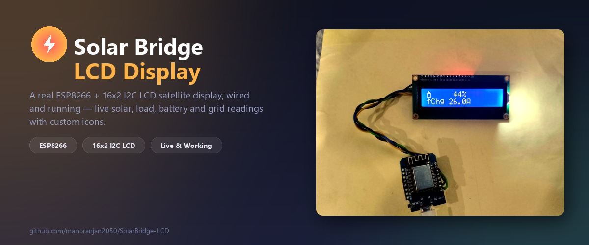
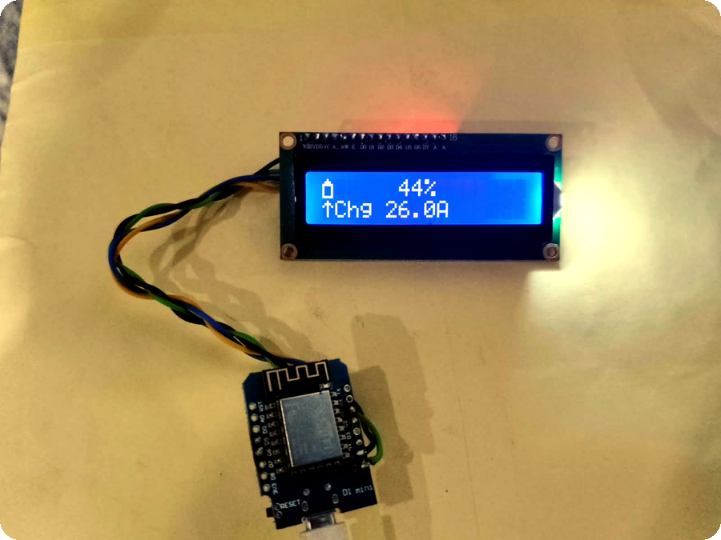
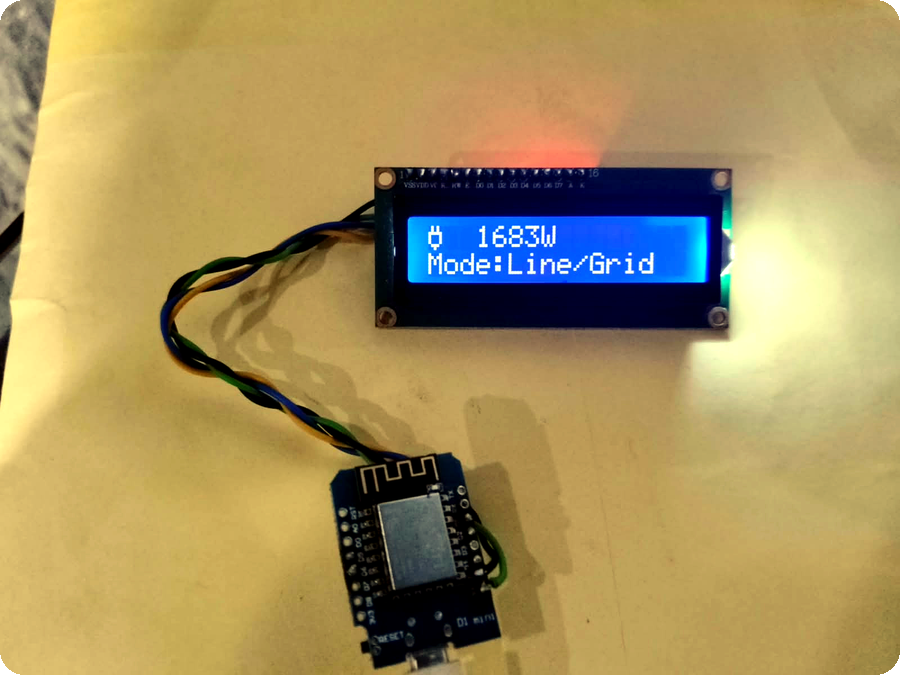
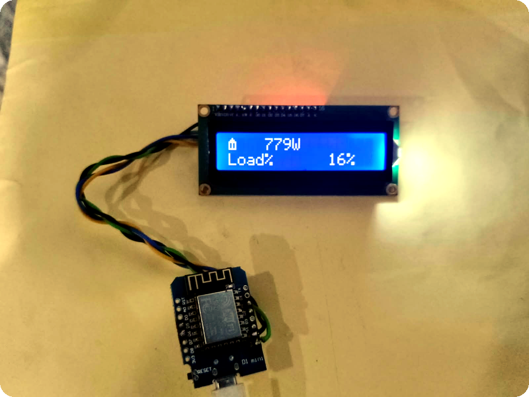
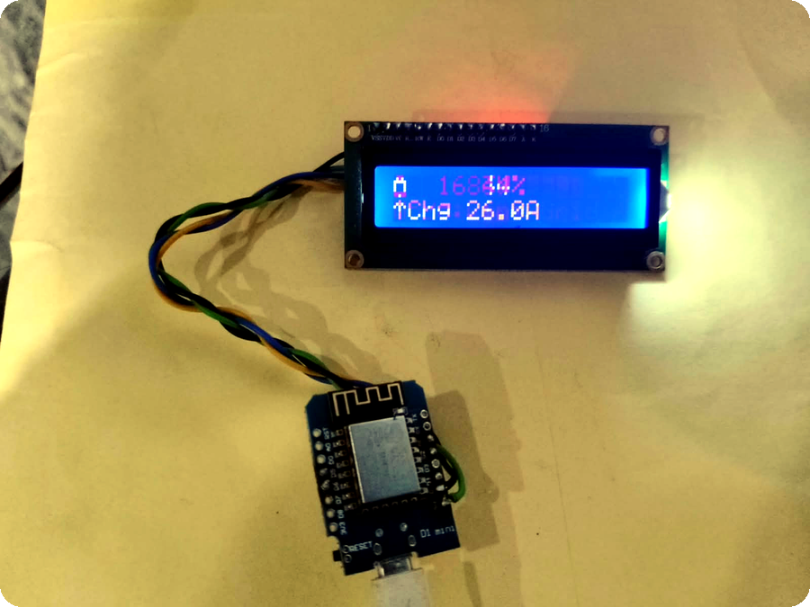
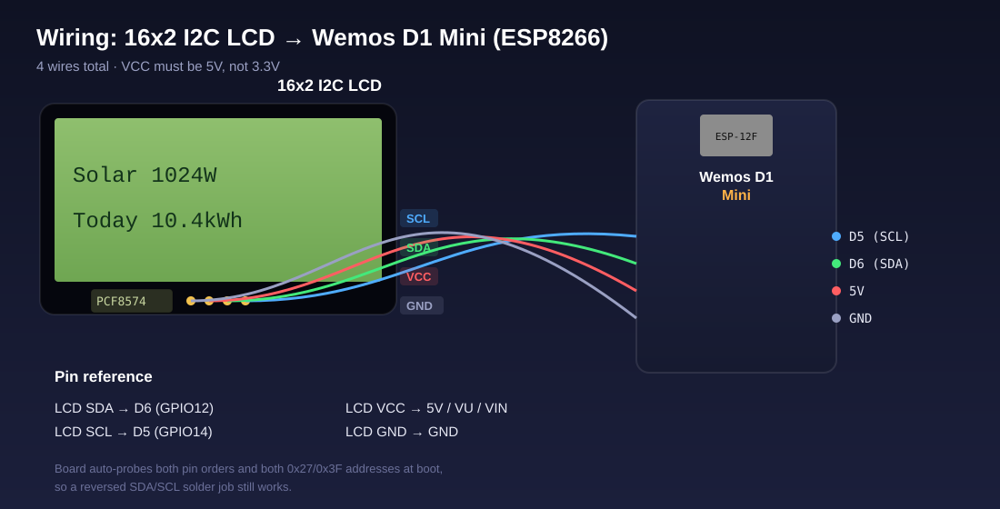

<p align="center">
  
</p>

A tiny satellite display for [Solar Bridge](https://github.com/manoranjan2050/Solar-Bridge-Flin-Fution-JKBMS) —
an ESP8266 + 16x2 I2C LCD that polls the same `/api/state` endpoint the web dashboard and
[Android app](https://github.com/manoranjan2050/SolarBridgeApp) use, and rotates through live solar,
load, battery and grid readings with icons pulled from
[LCD-Custom-Icons](https://github.com/manoranjan2050/LCD-Custom-Icons). No screen to unlock, no app
to open — just glance at the wall.

**Status: built, flashed, and confirmed showing live data.**

## What it shows

Seven pages, rotating every 4 seconds:

| Page | Line 1 | Line 2 |
|---|---|---|
| ☀️ Solar | `1024W` | `Today 10.4kWh` |
| 🏠 Load | `920W` | `Load% 24%` |
| 🔋 Battery | `76%` | `▲ Chg 6.2A` (or `▼ Dis`) |
| 🔌 Grid | `760W` | `Mode:Line` |
| 🔋 Battery packs | `P1:92% P2:88%` | `Total 183.7Ah` |
| 🔋 Backup time | `Backup time` | `~9.6h @1011W` (or `-- (no load)`) |
| 🔋 Charge time | `Charge time` | `~2.1h @740W` (or `Full` / `-- not charging`) |

Backup time is estimated live from the battery bank's total remaining capacity (Ah) × pack
voltage, divided by the current load (W) — it updates every poll, so it reflects the real
discharge rate right now, not a fixed nameplate estimate. It only shows a number while actually
under load; with no load (or while charging) it shows `-- (no load)` since "time to empty" isn't
meaningful there.

Charge time (time to full) is the mirror calculation: remaining Ah needed to reach 100% design
capacity, divided by the current charging amps — shown alongside the charging power (charging amps
× pack voltage). It only shows while the battery is actually charging; otherwise it shows
`-- not charging`, or `Full` if charging current is flowing but there's nothing left to top up.

Each line leads with a real custom-character icon on the LCD itself (solar panel, house, battery,
plug), not just text. If the inverter reports a hard fault, the display locks onto an `!` screen
with the message instead of rotating, for as long as the fault is active.

### Alert banner

The backend's alert engine (grid lost/restored, battery low, high temperature, overload, battery
full, inverter fault cleared, ...) also briefly takes over the display — for 10 seconds — whenever
a *new* one fires:

```
!WARNING
Grid power lost
```
```
!INFO
Grid power restored
```

After those 10 seconds it goes back to normal page rotation even if the underlying condition (e.g.
still running on battery) is still active — so a long grid outage doesn't lock the screen on a
warning for hours, it just flashes the news once and gets back to showing live numbers. Only a
genuine hard inverter fault stays locked on screen the whole time. Emoji and non-ASCII symbols in
alert text (⚡, °, ≤, ...) are stripped since the LCD's character ROM can't render them.

## Demo

Real unit, wired and running, cycling through live data pulled from production:

<table>
  <tr>
    <td width="50%"><br><sub align="center">Battery — SOC % + charge current, with the battery and up-arrow icons</sub></td>
    <td width="50%"><br><sub align="center">Grid — live import/export watts + inverter mode</sub></td>
  </tr>
  <tr>
    <td width="50%"><br><sub align="center">Load — consumption watts + load percentage</sub></td>
    <td width="50%"><br><sub align="center">Battery, mid-refresh — the 5s poll cycle updating in real time</sub></td>
  </tr>
</table>

## Hardware

| Part | Notes |
|---|---|
| ESP8266 dev board | NodeMCU or Wemos D1 Mini |
| 16x2 LCD + PCF8574 I2C backpack | Address `0x27` or `0x3F` — auto-detected at boot |
| 2x status LEDs (+ resistor each, ~220-330Ω) | Optional — low battery + high load alerts |

### Wiring

<p align="center">
  
</p>

| LCD backpack | ESP8266 (NodeMCU / D1 Mini) | GPIO |
|---|---|---|
| GND | GND | — |
| VCC | 5V (VU / VIN) — **not 3.3V** | — |
| SDA | **D6** | GPIO12 |
| SCL | **D5** | GPIO14 |

The firmware probes both `0x27`/`0x3F` *and* both SDA/SCL pin orders at boot, so a reversed
data/clock solder job still works without a code change.

### Status LEDs (optional)

Two plain GPIO LEDs for at-a-glance alerts, independent of what's currently showing on the LCD.
Each is just an LED + a ~220-330Ω resistor to GND — no driver needed.

| LED | ESP8266 pin | GPIO | Behavior |
|---|---|---|---|
| Low battery | **D1** | GPIO5 | Off above 30% SoC. Flashes (400ms) whenever battery SoC drops below **30%**. |
| High load | **D2** | GPIO4 | Off below 50% load. Flashes once load hits **50%**, speeding up as load climbs: |

Load LED flash rate:

| Load % | Flash speed | Interval |
|---|---|---|
| < 50% | Off | — |
| ≥ 50% | Normal flash | 500ms |
| ≥ 70% | A little faster | 250ms |
| ≥ 90% | Fast flash | 100ms |

Both LEDs run on a free-running blink timer independent of the LCD's 4-second page rotation, so
they keep flashing at the right rate no matter which page is showing.

## Installation

### 1. Get the code

```bash
git clone https://github.com/manoranjan2050/SolarBridge-LCD.git
cd SolarBridge-LCD
```

### 2. Wire the hardware

Connect the LCD backpack to the ESP8266 per the wiring table above. Double-check VCC is going to
**5V**, not 3.3V — most PCF8574 backpacks won't drive the display reliably on 3.3V.

### 3. Flash it — pick one

**Option A: PlatformIO (recommended, what this repo is set up for)**

```bash
# from the repo root, with the board plugged in over USB
pip install platformio      # if you don't already have it
platformio run --target upload
```

`platformio.ini` already pins the board (`nodemcuv2`) and pulls in the 3 required libraries
automatically on first build — nothing to install by hand. If your board enumerates on a port
other than what's set in `platformio.ini` (it changes any time you unplug/replug or use a
different USB port), override it: `platformio run -t upload --upload-port COM9` (or
`/dev/ttyUSB0` on Linux/Mac).

**Option B: Arduino IDE**

1. Open `SolarBridge-LCD/SolarBridge-LCD.ino` (the sketch lives in its own subfolder so the
   folder name matches the file, as Arduino IDE expects).
2. Install these three libraries via **Library Manager**: `WiFiManager` (tzapu), `ArduinoJson`
   (Benoit Blanchon, ≥6.19), `LiquidCrystal I2C` (marcoschwartz/johnrickman fork).
3. Board: **NodeMCU 1.0 (ESP-12E Module)**. Flash.

### 4. First boot — pair it with your Solar Bridge

1. **Get a read-only viewer token** from your Solar Bridge dashboard: **System** page →
   **Demo / Viewer Access** card. Use the viewer token here, not your admin token — this device
   only ever needs to *read* state, and a viewer token can't change a setting even if the board
   or its WiFi credentials were ever lost or cloned.
2. On first boot (or whenever it can't reconnect to WiFi), the board opens its own access point
   named **`SolarBridge-Setup`**. Connect to it from a phone — a setup page usually opens
   automatically, or go to `192.168.4.1` manually. Fill in:
   - Your WiFi network + password (**2.4GHz only** — the ESP8266 can't see 5GHz networks)
   - **Dashboard URL** — `https://solar.yourdomain.com` (Cloudflare Tunnel) or
     `http://solar.local:8080` (LAN only)
   - **Viewer API token** — from step 1
   - **Poll interval** — 5 seconds by default; raise it if you'd rather not hit your Pi as often
3. Save. The board reboots, connects, and live data appears on the LCD within a few seconds.

Re-run setup anytime by holding the board's FLASH button at boot, or just re-flash — WiFi and API
settings are stored in flash (LittleFS) and survive a normal reset.

### Optional: skip the portal for bench testing

Copy `SolarBridge-LCD/secrets.h.example` to `SolarBridge-LCD/secrets.h` and fill in real WiFi/
server/token values — the firmware uses those as defaults and skips the captive portal entirely.
`secrets.h` is gitignored; it never leaves your machine.

You can set a **primary and a backup WiFi network** (`DEFAULT_WIFI_SSID`/`DEFAULT_WIFI_SSID2`).
At boot the board tries the primary first, falls back to the backup if that fails, and — while
running — alternates between the two every 30 seconds if it ever loses the connection. Leave the
second pair blank (`""`) if you only have one network.

### 5. Later updates: flash over WiFi (OTA), no cable needed

Once this firmware (with `ArduinoOTA` built in) is on the board once via USB, every update after
that can go out over WiFi instead:

```bash
platformio run -t upload --upload-port 192.168.1.XXX --upload-flags="--auth=your-ota-password"
```

Use the board's IP (printed on boot in the serial log, `[OTA] ready, ... ip=...`, or check your
router's DHCP client list — hostname `solarbridge-lcd`). PlatformIO auto-detects the `espota`
protocol when the upload port looks like an IP instead of a serial port. Set `DEFAULT_OTA_PASSWORD`
in `secrets.h` (see `secrets.h.example`) — without one, OTA still works but anyone on the same
network could push firmware to the board. The LCD shows `OTA Update` and a progress percentage
while it flashes, then reboots into the new firmware automatically.

## Libraries

- **WiFiManager** by tzapu
- **ArduinoJson** (>= 6.19) by Benoit Blanchon
- **LiquidCrystal I2C** (the `marcoschwartz`/`johnrickman` fork)
- `LittleFS` and `ESP8266HTTPClient` ship with the ESP8266 Arduino core

## A note on TLS

The sketch uses `setInsecure()` for HTTPS (no certificate pinning) — simplest to set up and fine
for a read-only viewer token, but it does mean the board won't detect a MITM'd connection. If your
dashboard is only reachable on your LAN, use the plain `http://solar.local:8080` address instead
and skip TLS entirely.

## Related

- [Solar-Bridge-Flin-Fution-JKBMS](https://github.com/manoranjan2050/Solar-Bridge-Flin-Fution-JKBMS) —
  the Raspberry Pi bridge + web dashboard this pairs with.
- [SolarBridgeApp](https://github.com/manoranjan2050/SolarBridgeApp) — the Android companion app.
- [LCD-Custom-Icons](https://github.com/manoranjan2050/LCD-Custom-Icons) — the icon set used here.
- Built by [ElectroIoT](https://electroiot.in)
